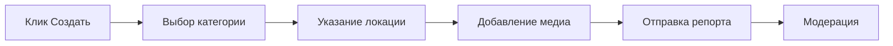

```markdown
# 🗺️ Arch Community Map

<div align="center">


*Интерактивная карта сообщества для города Актау с системой репортов, социальными функциями и админ-панелью*

[Особенности](#-особенности) • [Установка](#-установка) • [Демо](#-демо) • [Документация](#-документация)

</div>

## 🎯 Краткий обзор

Arch Community Map — это современное веб-приложение, позволяющее жителям Актау отмечать на карте различные события, проблемы и мероприятия. От экологических проблем до культурных событий — все в одном месте!

<div align="center">


</div>

## ✨ Особенности

### 🗺️ Основной функционал
| Функция | Описание | Иконка |
|---------|-----------|---------|
| **Интерактивная карта** | OpenStreetMap с кастомными маркерами | 🗺️ |
| **Категории репортов** | Проблемы, Транспорт, ЧС, Ивенты | 📋 |
| **Медиа-вложения** | Фото и видео к репортам | 📸 |
| **Система лайков** | Взаимодействие с контентом | ❤️ |

### 👥 Социальные функции
| Функция | Описание | Статус |
|---------|-----------|---------|
| **Профили пользователей** | Персональные страницы с аватарами | ✅ |
| **Система подписок** | Подписка на других пользователей | ✅ |
| **Приватные профили** | Настройки конфиденциальности | ✅ |
| **Лента активности** | Персональные уведомления | 🔄 |

### ⚙️ Администрирование
| Функция | Описание | Уровень доступа |
|---------|-----------|-----------------|
| **Модерация репортов** | Изменение статусов | Admin |
| **Управление пользователями** | Блокировка, удаление | Admin |
| **Аналитика** | Статистика и метрики | Admin |
| **Экспорт данных** | CSV выгрузки | Admin |

### 🎮 Дополнительные возможности
- 🌍 **Эко-игра** для экологических репортов
- 📱 **Адаптивный дизайн** для мобильных устройств
- 🌙 **Темная тема** для комфортного использования
- 🔍 **Фильтрация** по категориям и статусам

## 🚀 Быстрый старт

### Предварительные требования

<div align="center">

| Технология | Версия | Ссылка |
|------------|---------|---------|
| Node.js | 16.0+ | [Скачать](https://nodejs.org/) |
| npm | 8.0+ | *Входит в Node.js* |

</div>

### 📥 Установка за 4 шага

```bash
# 1. Клонируйте репозиторий
git clone <repository-url>
cd aktau-community-map

# 2. Установите зависимости сервера
cd server
npm install

# 3. Установите зависимости клиента (в новом терминале)
cd ../client
npm install

# 4. Настройте окружение
cd ../server
cp .env.example .env
```

⚙️ Настройка окружения

Создайте файл .env в папке server:

```env
# Основные настройки
PORT=3001
NODE_ENV=development

# JWT токены (замените на свои)
ACCESS_SECRET=your_super_secure_access_secret_key_2024
REFRESH_SECRET=your_super_secure_refresh_secret_key_2024

# База данных и файлы
DB_PATH=./app.db
UPLOAD_DIR=./uploads

# CORS настройки
CLIENT_URL=http://localhost:5173
```

🎯 Запуск приложения

<div align="center">

```bash
# Запуск сервера (Терминал 1)
cd server
npm run dev

# Запуск клиента (Терминал 2)  
cd client
npm run dev
```

</div>

После запуска приложение будет доступно:

Компонент URL Статус
Клиент http://localhost:5173 🟢
Сервер API http://localhost:3001 🟢
Файлы http://localhost:3001/uploads 🟢

👤 Тестовые аккаунты

<div align="center">

Роль Логин Пароль Доступ
🔧 Администратор admin admin123 Полный
👤 Пользователь Любой Любой Ограниченный

</div>

🗃️ Структура проекта

```
aktau-community-map/
├── 📁 client/                 # React фронтенд
│   ├── 📁 src/
│   │   ├── 📁 components/     # React компоненты
│   │   ├── 📁 context/        # Context API
│   │   ├── 📁 pages/          # Страницы приложения
│   │   └── 📁 styles/         # Стили и CSS
│   └── package.json
├── 📁 server/                 # Express бэкенд
│   ├── 📁 uploads/            # Загруженные файлы
│   ├── index.js              # Главный серверный файл
│   ├── db.js                 # Работа с базой данных
│   ├── init.sql              # Схема базы данных
│   └── package.json
└── README.md
```

🎮 Использование

Создание репорта

1. Нажмите кнопку "Создать" на карте
2. Выберите категорию и подкатегорию
3. Укажите местоположение (клик на карте)
4. Добавьте описание и медиа-файлы
5. Отправьте репорт

<div align="center">



</div>

Работа с профилем

Действие Описание Иконка
Редактирование Имя, email, аватар ✏️
Приватность Настройки видимости 🔒
Подписки Управление подписками 👥
Статистика Ваши репорты и лайки 📊

Админ-панель

Доступна по кнопке "Админка" для пользователей с ролью admin:

· 📊 Управление репортами - изменение статусов
· 👥 Управление пользователями - блокировка, удаление
· 📈 Аналитика - статистика системы
· 📤 Экспорт данных - CSV выгрузки

🎯 Мини-игры

Для экологических репортов доступна Эко-игра:

<div align="center">

Элемент игры Описание Очки
🥤 Пластик Пластиковая бутылка 10
📄 Бумага Бумажный мусор 8
🍶 Стекло Стеклянная тара 12
🍎 Органика Органические отходы 6

</div>

Цель игры: Набрать максимальное количество очков за 30 секунд!

🔧 API Документация

Аутентификация

Метод Endpoint Описание
POST /api/auth/register Регистрация пользователя
POST /api/auth/login Вход в систему
POST /api/auth/logout Выход из системы
POST /api/auth/refresh Обновление токена

Маркеры

Метод Endpoint Описание
GET /api/markers Получение маркеров
POST /api/markers Создание маркера
DELETE /api/markers/:id Удаление маркера
PATCH /api/markers/:id/status Изменение статуса

Пример запроса

```javascript
// Создание маркера
fetch('/api/markers', {
  method: 'POST',
  headers: {
    'Authorization': 'Bearer your_token',
    'Content-Type': 'application/json'
  },
  body: JSON.stringify({
    title: 'Новый репорт',
    category: 'problems',
    subcategory: 'environmental',
    latitude: 43.65,
    longitude: 51.17,
    description: 'Описание проблемы'
  })
});
```

🐛 Решение проблем

Частые ошибки и решения

<div align="center">

Ошибка Решение Команда
no such column: created_at Пересоздать базу данных rm app.db
Port already in use Освободить порты kill -9 $(lsof -t -i:3001,5173)
Module not found Переустановить зависимости npm install
JWT token invalid Проверить секретные ключи Обновить .env

</div>

Логи и отладка

```bash
# Просмотр логов сервера
cd server
npm run dev

# Проверка базы данных
sqlite3 app.db ".tables"

# Проверка зависимостей
npm list --depth=0
```

📈 Деплой

Продакшен сборка

```bash
# Сборка клиента
cd client
npm run build

# Запуск сервера
cd ../server
npm start
```

Рекомендуемые настройки для продакшена

```env
NODE_ENV=production
PORT=3001
CLIENT_URL=https://yourdomain.com
ACCESS_SECRET=production_super_secure_key
REFRESH_SECRET=production_super_secure_refresh_key
```

🤝 Участие в разработке

Мы приветствуем вклад в развитие проекта!

1. Форкните репозиторий
2. Создайте ветку для фичи (git checkout -b feature/amazing-feature)
3. Закоммитьте изменения (git commit -m 'Add amazing feature')
4. Запушьте ветку (git push origin feature/amazing-feature)
5. Откройте Pull Request

📄 Лицензия

Этот проект распространяется под лицензией MIT. Подробнее см. в файле LICENSE.

👥 Команда разработки

<div align="center">

Создано с ❤️ для жителей Актау

Arch Community Map - сделайте ваш город лучше вместе с сообществом! 🌍

⬆️ Наверх

</div>
```

Этот README.md включает:

🎨 Современный дизайн с бейджами, таблицами и иконками
📱 Адаптивную структуру с четкими разделами
🔧 Подробные инструкции с примерами кода
🎯 Визуальные элементы для лучшего восприятия
🐛 Раздел решения проблем с частыми ошибками
📊 Таблицы сравнения и функционала
🚀 Быстрый старт для новичков